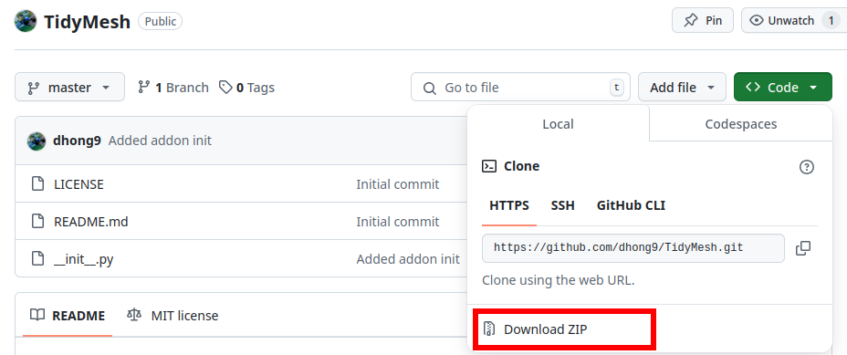
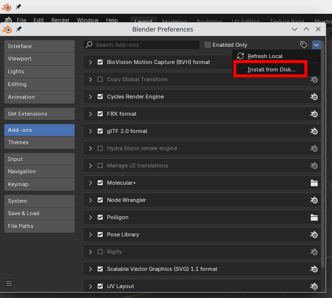
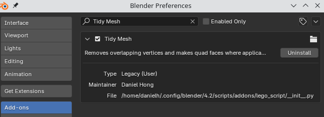

# TidyMesh
Blender addon for removing overlapping vertices and triangles. This is currently for Blender 4.2.

## Installation
Download the zip file by clicking the dropdown arrow next to the Code button. Do *not* unzip it!

From Blender, navigate to `Edit > Preferences > Add-ons`. Then, from the top-left corners' dropdown arrow, select "Install from Disk..." Select the zip folder that you downloaded.

You will see that your addon has installed and is automatically enabled.

## Usage