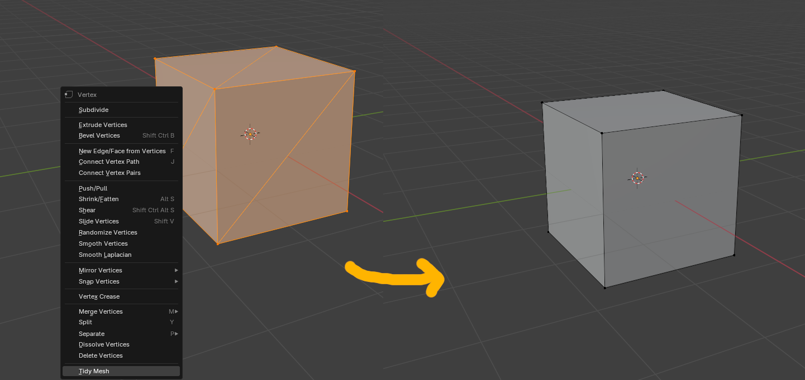

# Tidy Mesh
Blender addon for removing overlapping vertices and triangles. This is currently for Blender 4.2.

## Installation
Download the zip file by clicking the dropdown arrow next to the Code button. Do *not* unzip it!

From Blender, navigate to `Edit > Preferences > Add-ons`. Then, from the top-left corners' dropdown arrow, select "Install from Disk..." Select the zip folder that you downloaded.

You will see that your addon has installed and is automatically enabled.

## Usage
First, select vertices that you would like to tidy. Then, to access Tidy Mesh, which you can access by right clicking on your object in Edit mode to open the context menu. In doing so, you can see adjacent triangles merged and duplicate vertices removed.

